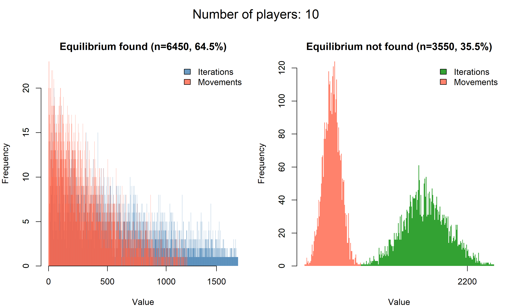

# Best-Response Dynamics in Random $n$-Player Games
## Introduction

In game theory, a Nash equilibrium (NE) is a strategy profile in which no player can unilaterally increase their payoff by deviating to a different strategy. Formally, for an $n$-player normal-form game with players $N = \{1, 2, \dots, n\}$, strategy sets $S_i$ for each player $i$, and payoff functions $u_i: S_1 \times \dots \times S_n \to \mathbb{R}$, a profile $s^{\ast} = (s_{1}^{\ast}, \dots, s_{n}^{\ast})$ is a pure strategy Nash equilibrium (PSNE) if for every player $i$ and any alternative strategy $s_i' \in S_i$, we have:

$$
u_i\bigl(s_i^\ast,s_{-i}^\ast\bigr)
\ge
u_i\bigl(s_i',s_{-i}^\ast\bigr).
$$

where $s_{-i}^*$ denotes the strategies of all players other than $i$. In other words, given the other players' choices, no single player can improve their utility by switching strategies. If the equilibrium allows randomized strategies, it is a mixed-strategy NE, but here we focus on pure strategies.

Best-response dynamics is an iterative process used to find a NE (if one exists) by simulating how players might myopically adjust their strategies. In this dynamic, players take turns updating their strategy to their current best response given the other players' strategies. A best response for player $i$ to a profile $s$ is any strategy $s_i' \in S_i$ that maximizes $u_i(s_i', s_{-i})$. We denote the best-response correspondence as:

$$
BR_i(s_{-i}) = \arg\max_{a \in S_i} u_i(a, s_{-i}).
$$

Starting from some initial profile $s(0)$, the process generates a sequence $s(1), s(2), \dots$ where at each step one player $i$ is selected and switches $s_i(t)$ to a best response $s_i(t+1) \in BR_i(s_{-i}(t))$. If the process reaches a profile where every player is already playing a best response to the others, then no one will switch—this profile is a Nash equilibrium (a fixed point of the dynamic).

However, in general games, the best-response dynamics is not guaranteed to converge; it may cycle through states indefinitely if no equilibrium is reachable. For example, the classic Matching Pennies game has no PSNE, and best-response play will oscillate. In some cases, the convergence depends on the strategy profile selected to initialize the algorithm.

## Motivation

Both finding Nash equilibria and simulating best-response dynamics become extremely challenging as games grow in size. Most textbook examples of NE analysis involve small games (e.g., 2 or 3 players, or only a few strategies) because the strategy space grows exponentially with the number of players and strategies. In a game with $n$ players each having 2 strategies, there are $2^n$ possible strategy profiles. This exponential growth makes brute-force analysis intractable for large $n$. Determining whether a PSNE exists or finding one can require checking many profiles in the worst case. Indeed, the state space of a best-response process is all $2^n$ profiles, and a naive search might have to examine an exponential number of cases.

The algorithmic complexity of best-response dynamics can be prohibitive: while each step is a myopic improvement, the number of steps needed to reach equilibrium (if it converges at all) can be exponential in the number of players or profiles (CS IDC reference). In fact, even in classes of games where convergence is guaranteed (e.g., potential games), there are contrived examples where best-response sequences take an exponential number of iterations to terminate. Because of these complexity issues, equilibrium analysis for arbitrary large $n$-player games is typically limited.

However, it is insightful to study random $n$-player games to understand how often a pure Nash equilibrium might exist and whether simple dynamics can find one. Theory predicts that as games become larger (more players or more strategies), pure NE are increasingly unlikely to exist or be reached. Recent research shows that the probability a random game will be convergent (i.e., the best-response process finds an equilibrium) drops toward zero as the number of players or strategies grows large. This simulation project is motivated by these questions: for small vs. moderate vs. larger $n$, how often does best-response dynamics find an equilibrium in a random game, and how many iterations does it take?

## Game Setup

We consider an $n$-player normal-form game with two strategies per player. Label the strategies as 0 and 1 for convenience (e.g., each player chooses either strategy 0 or strategy 1). There are $n$ players, so the total number of possible strategy profiles (strategy combinations) is $2^n$. We denote a generic profile as $s = (s_1, s_2, \dots, s_n)$ where $s_i \in \{0,1\}$ is the strategy of player $i$.

In our simulation, each player's utility for every possible profile is assigned at random. In other words, for each player $i$ and each profile $s \in \{0,1\}^n$, we draw a random payoff value $u_i(s)$. This yields a random game instance with no special structure or symmetry. For example, if $n=4$, each player has $2^4=16$ payoff entries, one for each profile of all players' choices. The random payoffs are i.i.d. draws from a uniform distribution. There are no exact ties in payoffs almost sure. This means each player will typically have a unique best response to any given profile of the others.

Because the game is random, there is no guarantee that a pure-strategy Nash equilibrium exists; whether a PSNE exists is itself a random outcome. For small $n$, there's a reasonable chance a PSNE might exist by coincidence. But as $n$ grows, having a profile that simultaneously maximizes each player's payoff (against the others) becomes rarer. 

## Simulation Method

To investigate best-response dynamics, we simulate an iterative play process in R for each random game instance. The high-level procedure for each simulation is as follows:

**Initialization:**
- Start at a fixed initial strategy profile. In our code, we use the profile where every player initially plays strategy 0 as the starting point. Given the fact that the utilities are random, this profile is not special.

- Initialize a logical vector that indicates whether each player agrees with the strategy. Set all values to `FALSE` initially.  

- **Best-Response Update Loop**: Repeatedly allow players to update their strategies one at a time:
  - For each iteration, choose the first player that doesn´t agree and evaluate whether that player can improve their payoff by switching to their other strategy. Since there are only two strategies (0 or 1), this check is straightforward: we compare the player's payoff in the current profile vs. what it would be if they flipped their strategy.
  - If switching strategies yields a strictly higher payoff for that player (i.e., it’s a best response), then update the player’s strategy to that best response and change the `agree` status to `FALSE` for all other players. If switching does not improve that player’s payoff (i.e., the current strategy is already a best response or tied as the best), then the player stays with the current strategy, changes its `agree` status to `TRUE`, and leaves the other players’ statuses unchanged.
- Continue to the next player and repeat the check. 

- **Termination Conditions**: The iterative process continues until one of two stopping conditions is met:
  - **Convergence to Equilibrium**: If in a full cycle of updates no player changes their strategy, that means every player is best-responding to the others. At this point, the profile is a Nash equilibrium, and the dynamic has converged. We record that a PSNE was found.
  - **Cycle Detection**: If the process produces a strategy profile that has occurred previously, we have entered a cycle. In other words, the dynamics are now repeating a prior state and will continue to loop endlessly without finding an equilibrium. When a repeat profile is detected, we terminate the simulation and record that it failed to converge (cyclic behavior). In practice, our code keeps a history (set) of visited profiles to quickly check for repetition. Because the game has a finite number of profiles ($2^n$), a cycle detection also implicitly serves as a safeguard against infinite loops—if no equilibrium exists, Poincaré recurrence guarantees some profile will eventually repeat.

- **Iteration Counting**: Throughout the loop, we count how many individual strategy updates (iterations) occur. This gives a measure of how long the dynamics ran before stopping. Convergence in very few iterations might indicate the game had an "easy" equilibrium that was quickly reached, whereas a long run that ends in a cycle indicates the dynamic wandered a lot without finding a stable point.

After setting up this process for one game, we repeat the simulation across many independent random games for each value of $n$ we are interested in. 

### Code

In the R code, the logic described above is implemented with the help of two scripts:

- `functions.R`: This file contains helper functions for setting up and evaluating the game. For instance, it likely has a function to generate random payoff matrices for all players given $n$, and functions to compute a player's best response or to check if a profile is a NE. It may also contain the function that performs one iteration of the best-response update (choosing a player and possibly switching their strategy).
- `best_response.R`: This is the main simulation script. It uses the functions defined in `functions.R` to run the best-response dynamics. It initializes the game, runs the iterative loop with the update rules, and monitors the stopping conditions. This script is also responsible for running multiple simulations (for statistical analysis) and recording the outcomes. In addition, `best_response.R` produces visualizations of the results and saves them to files.

## Results

We analyzed the outcomes of the best-response dynamics over 100000 games and different numbers of players $n$. The findings align with expectations from game theory: as $n$ grows, the dynamics have a harder time finding an equilibrium. More formally, larger games are less likely to possess (and converge to) a pure Nash equilibrium, and the process tends to take more iterations to either find an equilibrium or to conclude it is cycling. Here we summarize the key observations:

### Frequency of Convergence

For small games, the best-response dynamics often converges to a PSNE. For example, with $n=2$ players (each with 2 strategies), the algorithm finds a PSNE in 87.3% of the games, while with $n=10$ players, only 1.5% of the games converge to a PSNE. Note that the algorithm cannot conclude there are no PSNEs; it only determines that no PSNE was found along the trajectory. 

### Iterations Distribution

Along with a decreased chance of success, larger games required more update steps on average before the simulation stopped. For $n=2$, if an equilibrium existed, it was found very quickly (In 2 to or 4 iterations of play). Even cycles in 2-player games were short (in a 2-player game with no equilibrium, the two players simply alternate their moves, leading to an immediate 2-cycle). In contrast, for $n=10$ players, the sequences of best-response moves before detecting a cycle were typically much longer. We observed a wide spread in the number of iterations for larger $n$. Some runs went on for more than a hundred of before a repeat profile was seen. The distribution of iteration counts shifted toward higher values as $n$ grew. This indicates that when an equilibrium is not quickly reachable, the dynamics can wander through many states—reflecting the potential exponential complexity of the state space. Below we provide example histograms of the number of iterations for different $n$ values.

### Example Plots

The repository includes plots visualizing these results for various $n$. In the `plots/` directory, you will find images named `game_results_2.png`, `game_results_4.png`, `game_results_6.png`, `game_results_8.png`, and `game_results_10.png`. Each plot corresponds to simulations at a given number of players and shows the fraction of runs that converged to a PSNE, along with a histogram of the iteration counts. Below are the plots for $n=2$, $n=4$, and $n=10$, illustrating the trends described:

- For $n=2$ players: The plot shows that almost all runs converged, usually in very few iterations.  
    
  **Figure 1**: Simulation outcomes for $n=2$.

- For $n=4$ players: The plot illustrates a mix of outcomes. Many runs still found an equilibrium, but a significant number resulted in cycles. The iteration count histogram is more spread out compared to $n=2$, indicating some games took longer to resolve.  
    
  **Figure 2**: Simulation outcomes for $n=4$.

- For $n=10$ players: The plot highlights that convergence was very rare. Most simulations ended in cycling behavior, and the iteration counts were often quite large before a cycle was detected.  
    
  **Figure 3**: Simulation outcomes for $n=10$. 

These plots confirm that as the game grows more complex (in terms of number of players), finding a stable outcome via naive best-response play becomes significantly less likely and more time-consuming. In summary, small games may reach a stable equilibrium easily, but larger random games often exhibit persistent oscillations with no equilibrium, in line with theoretical expectations.

## Future work

This simulation provides insights into best-response dynamics in random $n$-player games, but several extensions could enhance its scope and depth:

- **Comprehensive Nash Equilibrium Search**: Currently, the simulation follows a single best-response trajectory to detect a pure-strategy Nash equilibrium (PSNE) or a cycle. A future improvement would be to exhaustively check the entire game for all possible PSNEs, not just those reachable from the initial profile of all zeros. This would involve evaluating all $2^n$ strategy profiles before concluding a PSNE.

- **Analytical Properties of Iteration Distribution**: The simulation empirically collects the distribution of the number of iterations required for convergence or cycle detection. A valuable extension would be to analytically derive properties of this distribution, such as its mean, variance, and higher moments. 

- **Expansion to More Strategy Choices**: The current setup assumes each player has exactly two strategies (0 or 1), leading to $2^n$ possible profiles. Generalizing the simulation to allow more than two strategies per player (e.g., $k$ strategies, resulting in $k^n$ profiles) would make the model more realistic and applicable to a broader range of games. This would also allow us to study how the increased strategy space affects convergence rates and the likelihood of finding a PSNE.

- **Structured Utility Functions**: The payoffs in this simulation are drawn randomly from a uniform distribution, creating games with no inherent structure. Future work could introduce structure to the utility functions, such as imposing symmetry, correlation, or specific game-theoretic properties (e.g., modeling potential games or coordination games). This would enable the study of best-response dynamics in more realistic or domain-specific scenarios, potentially improving convergence behavior or revealing new patterns in equilibrium formation.

- **Computational complexity**: Deepen in the computational complexity of the algorithm. Find boundaries for the number of iterations. 
